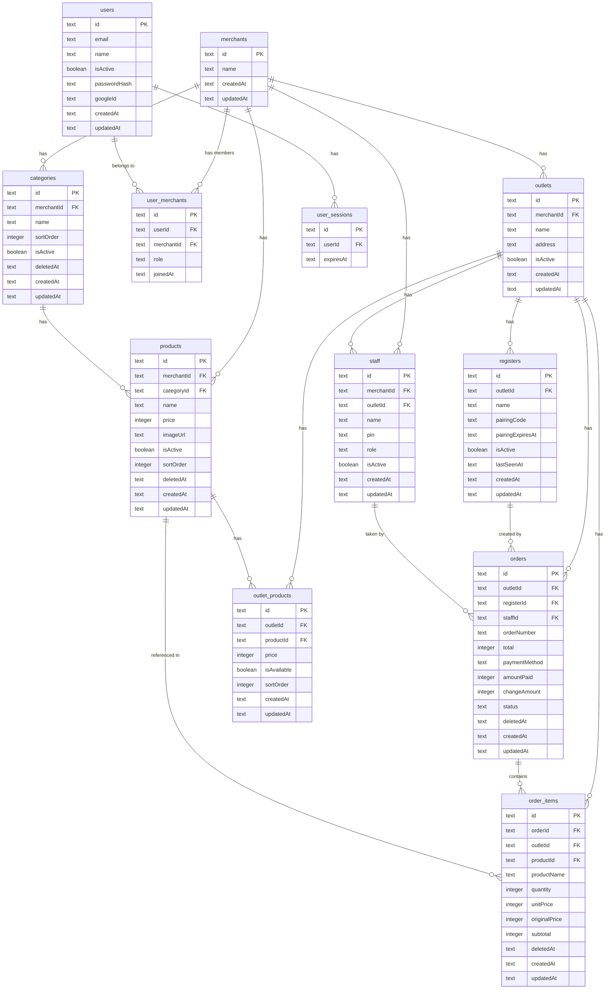

# Multi-Store Schema Design

## Entity Relationship Diagram



## Hierarchy

```
Merchant (The Business)
└── Outlets (The Locations)
    └── Registers (The Devices/Tablets)

Merchant
├── Users (via user_merchants pivot — owner, manager roles per merchant)
├── Staff (cashiers — belong to merchant, assigned to outlet)
├── Categories (shared across outlets)
└── Products (shared across outlets)
    └── outlet_products (per-outlet price/availability overrides)

Outlet
├── outlet_products (which products are available + local pricing)
├── Staff (cashiers assigned to this outlet)
├── Orders (scoped to this outlet)
│   └── Order Items
└── Registers (devices locked to this outlet)
```

## Key Design Decisions

| Decision | Rationale |
|----------|-----------|
| Users vs Staff split | Users (email/password) are for backoffice. Staff (name+PIN) are for cashiers. No email required to ring up orders. |
| user_merchants pivot | Multi-merchant access. Role is scoped per merchant. A user can be "owner" of one merchant and "manager" of another. |
| Products belong to Merchant | Single source of truth for menu. Update once, reflects everywhere. |
| outlet_products pivot | Per-outlet price overrides and availability. Null price = use product default. |
| Orders scoped to Outlet | Each outlet has its own sales data. Sync pulls only the outlet's orders. |
| orders.staffId (not userId) | Orders are taken by cashiers (staff), not backoffice users. |
| Order number format: `{registerShortId}-{seq}` | Prevents offline collision. Each register generates unique sequential numbers. e.g. `K1-0001`, `K2-0001`. |
| order_items.originalPrice | Tracks merchant-level price at time of sale. Enables variance reporting (outlet price vs default). |
| order_items.outletId denormalized | Avoids JOINs when pulling data for a specific register's offline payload. |
| registers table | Device PIN provisioning. A register is locked to one outlet. Single-use pairing code + 24h expiry. |
| UUID v7 everywhere (server + local) | No ID mapping during sync. Time-sortable for efficient indexing. Generated client-side before insert. |
| Fresh schema (no migration) | No production data exists yet. Clean start. |

## Auth Flow Summary

```
Entry Point
├── "Masuk sebagai Pemilik" → /cloud-login
│   ├── Email + Password or Google OAuth
│   ├── Merchant Picker (if user belongs to multiple merchants)
│   ├── Owner Setup Wizard (if no merchant yet)
│   │   ├── Step 1: Create Merchant (business name)
│   │   └── Step 2: Create First Outlet (branch name + address)
│   └── Dashboard (multi-outlet overview)
│
├── "Masuk sebagai Kasir" → /login
│   ├── Staff selection grid (avatar buttons)
│   ├── PIN pad entry (4-6 digit)
│   └── POS screen (locked to assigned outlet)
│
└── "Hubungkan Perangkat" → /device-pair
    ├── Enter 6-digit pairing code
    ├── Device authenticates, registers as new Register
    ├── Initial sync (pull outlet data to local SQLite)
    └── Redirects to /login (staff PIN entry)
```

## ID Strategy: UUID v7 Everywhere

Both server (Turso) and local (Tauri SQLite) use **UUID v7** as text primary keys. Generated client-side with `crypto.randomUUID()` or a lightweight library.

**Why not auto-increment integers + cloudId mapping?**
When a cashier goes offline and creates Order `local_id: 1` with Order Items pointing to `order_id: 1`, syncing requires rewriting every foreign key from `1` to `uuid-xyz`. UUID v7 eliminates this — the ID is the same everywhere from creation.

**Why UUID v7 (not v4)?**
- Time-sortable — natural B-tree insertion order, no index fragmentation
- Contains a Unix timestamp — useful for debugging and sorting without extra columns
- Compatible with `crypto.randomUUID()` via polyfill or `uuidv7` npm package

## Server vs Local Schema

| Server (Turso) | Local (Tauri SQLite) |
|----------------|---------------------|
| All tables above | Matching tables + sync metadata |
| No `isSynced` column | `isSynced` boolean on orders, order_items, categories, products |
| Same UUID v7 PKs | Same UUID v7 PKs (no ID mapping needed) |
| Full relational data | Only data for the paired outlet |
| `registers` tracks pairing | Local stores current `registerId` + `outletId` |
| All staff for merchant | Only staff for paired outlet |
| All products for merchant | Only products available at paired outlet (via outlet_products) |
