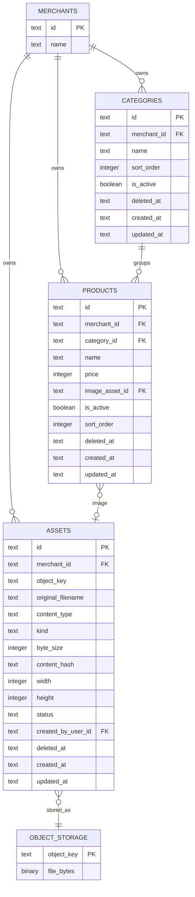
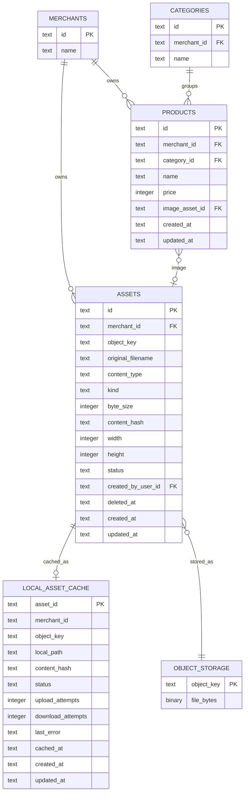

# Product Photo Asset ERD

## API Side

API-side notes:

- The API DB stores reusable asset metadata in `assets`.
- The API DB does not store `local_asset_cache`.
- `products.image_asset_id` points to `assets.id`.
- `assets.object_key` points to the uploaded object in S3-compatible storage.
- Object storage contains the actual file bytes.
- Future tables can reuse the same `assets` table, for example `users.photo_asset_id` or `outlets.logo_asset_id`.

## Local POS Side

## Where Each Entity Lives

| Entity | API DB | Local POS DB | Object Storage |
| --- | --- | --- | --- |
| `merchants` | Yes | Yes | No |
| `categories` | Yes | Yes | No |
| `products` | Yes | Yes | No |
| `assets` | Yes | Yes | No |
| `local_asset_cache` | No | Yes | No |
| `OBJECT_STORAGE` | No | No | Yes |

## Relationship Summary

- `products.image_asset_id` stores the selected photo asset for a product.
- `assets.object_key` stores the S3-compatible object key.
- `local_asset_cache.asset_id` points to the synced asset and tracks the local file path plus upload/download state.
- Object storage is the source of truth for the actual file bytes.
- The API DB syncs product and asset metadata only, not image bytes.
- Each POS device builds its own local image cache from synced `assets`.
