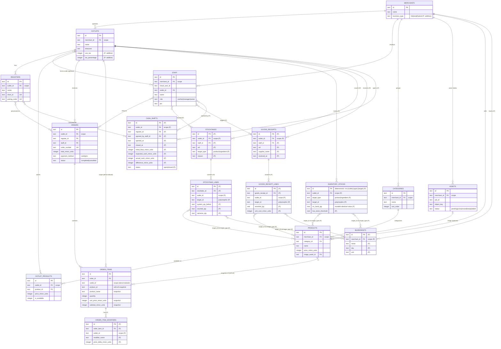
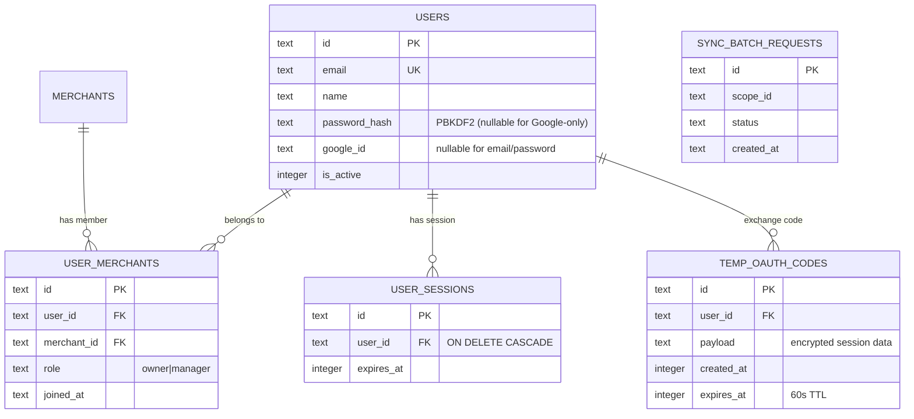
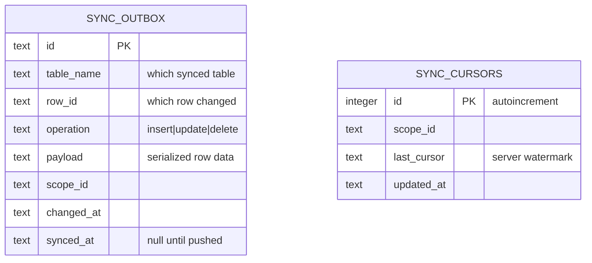

# Database Design

> **Status:** Authoritative architectural reference. Covers current schema (10 synced + 5 API-only + 2 app-only tables) and the planned extension (8 new synced tables, additive columns, hardening indexes). Extension tables marked `(planned)` — implementation pending sign-off.
>
> **Source of truth:** `packages/sync-contract/src/` (schema files), `vendor/baresync/packages/baresync/src/` (engine constraints).

---

## Architecture: Three-View Schema Model

Sakti POS uses a **local-first** architecture. The POS app reads and writes a local SQLite database directly (no network needed for operation). A background sync engine (`baresync`) reconciles changes with the server's Turso/libSQL database when connectivity is available.

This split produces **three distinct views** of the database:

| View | Lives in | Synced? | Purpose |
|------|----------|---------|---------|
| **Synced schema** | Both API + POS (mirrored) | ✓ | Shared business domain — the POS data model that both sides agree on |
| **API-only schema** | API server only | ✗ | Cloud auth, identity, membership — must never reach the device |
| **App-only schema** | POS device only | ✗ | Sync infrastructure (outbox + cursors) — has no business meaning on the server |

### Why three views, not one shared schema?

**Security isolation.** Auth tables (`users`, `userSessions`, `passwordHash`, `googleId`) contain secrets that must never leave the server. They are structurally excluded from the sync contract — there is no path for them to reach the device, even accidentally.

**Sync machinery isolation.** The `syncOutbox` and `syncCursors` tables are client-side engine internals. They have no business meaning and no server-side equivalent. Mixing them into the domain schema would pollute the shared contract.

**Separation of concerns.** Each view has a single owner. The synced schema is co-owned (paired). The API-only schema is server-owned. The app-only schema is engine-owned (`baresync` generates it).

---

## Design Conventions

Every synced table follows these rules without exception:

### Identifiers
- **Primary key:** single `text` column named `id`. No composite PKs — baresync requires a single text `id`.
- **UUIDv7 (default):** most tables use `.$defaultFn(() => uuidv7())`. Time-ordered values are B-tree friendly (sequential inserts don't fragment the index), lexicographically sortable, and globally unique without coordination between client and server.
- **Deterministic IDs (bridge tables):** tables with a natural composite uniqueness key use a **deterministic derived ID** instead of UUIDv7. This is required because baresync upserts pulled rows by PK (`INSERT ... ON CONFLICT(id) DO UPDATE`, verified in `vendor/baresync/.../push.rs`). With random UUIDv7, two devices creating the same logical row (e.g. both registers in one outlet initializing stock for the same product) produce two non-merging rows. With a deterministic ID derived from the natural key, both devices target the same PK and converge to one row via upsert. The current exception is `inventory_stocks` (ID format: `inv:{outletId}:{targetType}:{targetId}`). Readable string IDs are preferred over opaque hashes for sync-log debuggability. This pattern should be applied to any future bridge/junction table scoped by a natural composite key.

### Money
- **Integer minor units**, always. Column suffix `_minor_units`. Example: `price_minor_units = 15000` means Rp 150.000. No `REAL` or `NUMERIC` for currency anywhere — IEEE 754 floats introduce drift (`0.1 + 0.2 ≠ 0.3`), which is unacceptable for financial data.

### Quantities
- **`REAL` for inventory quantities** (fractional kg/L for F&B ingredients). `INTEGER` for count-based quantities (order line item qty, modifier qty).

### Soft deletes
- No hard `DELETE` on synced tables. Instead: set `deleted_at` timestamp + `is_synced = false`. The sync engine pushes this as an update so the server marks the row deleted. Hard deletes can't be synced (there's no row to push).

### Immutability of denormalized-scope rows
- Child tables that denormalize their scope column (`order_items`, `stocktake_lines`, `goods_receipt_lines`, `order_item_modifiers` — all carry `outlet_id` directly) are **immutable once committed** at the application layer. Mutating a parent's scope (e.g. moving a completed order to another outlet) would require cascading updates to every child's denormalized scope column — exactly the kind of multi-row rewrite that destabilizes incremental sync (each rewritten child row re-enters the outbox and re-pushes). POS financial ledgers are append-only by domain rule anyway; enforce this in app code, not the schema.

### Soft references (local side)
- The **local schema has no hard foreign keys** (`.references()`). All inter-table references are plain `text` columns resolved app-side. The **API schema uses real FKs** (`.references()` with referential integrity).
- **Why the asymmetry:** Under server-wins sync, a pull can deliver a row whose referenced row hasn't arrived yet (different scope, delayed sync, or the parent was soft-deleted). A hard FK would reject the INSERT and silently drop the row from sync. Soft refs on the client side tolerate this; the API side enforces integrity because it always has the full dataset.

### Enums
- **Drizzle text enums** (`text("status", { enum: [...] })`), never `.check()` constraints. baresync does not inspect CHECK constraints — a server-pushed row violating a local CHECK fails the INSERT silently and drops out of sync. Text enums provide TypeScript type safety without DB-level constraint enforcement.

### Sync columns (added automatically by spread)
Every synced table spreads either `...localSyncColumns()` or `...apiSyncColumns()`:

| Column | Local | API | Purpose |
|--------|-------|-----|---------|
| `deleted_at` | text | text | Soft delete timestamp |
| `is_synced` | integer bool, default false | — | Local dirty flag (false = needs push) |
| `sync_updated_at` | — | integer | Server-side cursor watermark |
| `created_at` | text | text | Row creation timestamp (ISO 8601 UTC) |
| `updated_at` | text | text | Last modification timestamp |

### Scope columns
- Every synced table has a **scope column** (e.g., `merchant_id`, `outlet_id`) registered in `sync.config.ts`. The sync engine uses this to partition data per tenant/location. Scope columns are `NOT NULL` on synced tables.
- **Child tables denormalize their scope** — e.g., `order_items` carries `outlet_id` directly (not just `order_id`) because baresync filters by the row's own scope column, not through joins.

### Indexes
- **Sync index (mandatory):** API has `(scope_column, sync_updated_at)` composite; local has `(is_synced)`. These serve the sync engine's pull/push queries.
- **Read-path indexes (per query pattern):** Added on both sides to serve the UI's actual queries (catalog render, receipt build, report history). See the hardening section of the design plan.

---

## ERD: Synced Schema

The shared business domain. **18 tables** (10 current + 8 planned). Every table exists in both `api-synced-schema.ts` and `local-synced-schema.ts` with identical business columns but different sync metadata.

> **Diagram note:** Sync metadata columns (`is_synced`, `deleted_at`, `created_at`, `updated_at`, `sync_updated_at`) are omitted from entity definitions for clarity — they exist on every table. Only PK, scope, FK, and key business columns are shown. `(P)` = planned extension table.



---

## ERD: API-Only Schema

Server-side tables that exist **only in the API database** (`api-schema.ts`). These handle cloud authentication, user identity, membership, and OAuth flow. They are structurally excluded from the sync contract — no path to the device.



### Why these are server-only

| Table | Reason it never syncs |
|-------|----------------------|
| `users` | Contains `password_hash` and `google_id` — credentials must never reach the device |
| `user_merchants` | Membership is resolved server-side during auth; the device learns its scope via the sync contract, not by syncing the join table |
| `user_sessions` | Session lifecycle is server-managed (Narvik); the device receives a token, not the session row |
| `temp_oauth_codes` | 60-second TTL exchange codes for Google OAuth — ephemeral, single-use |
| `sync_batch_requests` | Server-side sync batch tracking for idempotency/replay protection — engine internal |

**How the device learns identity without these tables:** The `staff` table (synced) bridges cloud identity to POS via `staff.cloud_user_id`. After cloud auth, the API creates/links a `staff` row and the device syncs it. The device never sees the `users` row.

---

## ERD: App-Only Schema

Client-side tables that exist **only in the POS local database** (`local-schema.ts`). These are baresync engine infrastructure — the outbox (pending changes) and cursors (last-synced watermark). No business meaning; no server-side equivalent.



### How these work

**`sync_outbox` — the outbox pattern.** Every syncable write goes through `writeTransaction()` + `enqueueChange()`. This atomically performs the mutation AND inserts an outbox entry. If the network is down, the entry waits. On the next poll cycle, the engine pushes pending entries and marks `synced_at`. There is a partial unique index `WHERE synced_at IS NULL` ensuring one pending entry per row (dedup).

**`sync_cursors` — pull watermark.** Stores the server's `sync_updated_at` watermark per scope. On each pull, the engine requests rows with `sync_updated_at > last_cursor` and advances the cursor. This is incremental sync — only changed rows transfer.

**Why app-only:** These tables are engine internals with no business semantics. They're generated by baresync (`createSyncOutboxTable()`, `createSyncCursorsTable()`) and managed entirely by the sync engine. The app never writes to them directly — it goes through `writeTransaction()`.

---

## Design Decisions

### Why paired schemas (two files for the same tables)?

baresync requires the same business columns on both sides but **different sync metadata**. The local side needs `is_synced` (dirty flag); the API side needs `sync_updated_at` (cursor watermark). These can't coexist in one file. The generator validates column-by-column that the business columns match exactly (by snake_case SQL name), throwing on any drift.

```
local-synced-schema.ts          api-synced-schema.ts
├─ products                     ├─ products
│  ├─ id (PK)                   │  ├─ id (PK)
│  ├─ merchant_id               │  ├─ merchant_id
│  ├─ name                      │  ├─ name
│  ├─ price_minor_units         │  ├─ price_minor_units
│  ├─ ...localSyncColumns()     │  ├─ ...apiSyncColumns()
│  │  ├─ is_synced     ← local  │  │  ├─ sync_updated_at ← API
│  │  ├─ deleted_at             │  │  ├─ deleted_at
│  │  ├─ created_at             │  │  ├─ created_at
│  │  └─ updated_at             │  │  └─ updated_at
```

### Why UUIDv7?

Three reasons over alternatives:
1. **B-tree friendly** — UUIDv7 is time-ordered, so inserts append to the end of the index rather than scattering randomly (UUIDv4's problem). No fragmentation, no page splits.
2. **No coordination** — client and server both generate IDs without a central counter or sequence. A device creates an order offline, the UUID is globally unique, no collision when it syncs.
3. **Sortable** — lexicographic order = chronological order. Useful for "latest N" queries and debugging.

### Why integer minor units for money?

SQLite's `REAL` type is IEEE 754 double-precision float. The decimal `0.1` has no exact binary representation. Accumulating floats across a day's transactions produces visible drift (Rp 1-2 off on the Z-report). Storing money in **integer minor units** (rupiah sen) eliminates this entirely. The trade-off — manual formatting for display — is handled by `formatRupiah()` in `~/lib/utils`.

### Why no CHECK constraints?

Verified from `vendor/baresync/.../generator/diagnostics.ts`: baresync's schema validator inspects column types, PKs, scope columns, and sync metadata — but **does not inspect CHECK constraints**. Under server-wins conflict resolution, the server's version of a row overwrites the local version. If the server-pushed row violates a local-only CHECK constraint, the INSERT fails silently and the row drops out of sync permanently. Drizzle text enums (`text("status", { enum: [...] })`) provide TypeScript-level type safety without any DB-level constraint that could reject a sync push.

### Why soft references on the local side?

The API database enforces referential integrity with real foreign keys (`.references()`). The local database deliberately does NOT. Reason: under incremental pull sync, rows arrive in batches. A child row (e.g., `order_items`) may arrive before its parent (`orders`) if they're in different sync scopes or batches. A hard FK would reject the child INSERT. Soft references (plain `text` columns, resolved app-side) tolerate any arrival order. The app enforces integrity through query joins, not DB constraints.

### Why polymorphic `inventory_stocks`?

Two real inventory targets exist: `products` (retail items) and `ingredients` (F&B raw materials). Both have identical inventory semantics (on-hand qty, low-stock threshold, per-outlet). A single table with `target_type` + `target_id` is simpler and more maintainable than two parallel tables (`product_inventory_stocks` + `ingredient_inventory_stocks`). The polymorphic association is **not a phantom** — both target tables exist in the schema.

### Why relational `order_item_modifiers` (not JSON)?

The alternative was storing modifiers as a `text({ mode: "json" })` column on `order_items`. Three problems with that approach:
1. **baresync warning** — `SYNC_SCHEMA_JSON_ONLY_FIELD`: "JSON-typed columns require special handling during serialization."
2. **Inconsistency** — `order_items` already snapshots relationally (`product_name`, `unit_price_minor_units`, `subtotal_minor_units` as real columns). JSON modifiers would break the pattern.
3. **No analytics** — can't query "how many extra shots sold this month" without parsing JSON per row.

A relational table costs one indexed join on receipt render (sub-millisecond on local SQLite) and gains queryability + consistency + no baresync warnings.

### Why header + lines for stocktakes and goods-receipts?

The UI forms submit **batches**: one counting session (`ref`, `reason`, `staff`) with many counted items. A flat single-table design (`stocktake_entries` with header fields repeated per row) violates 3NF and makes session-level queries painful (GROUP BY to reconstruct the session). The header + lines pattern mirrors the existing `orders` + `order_items` structure — a proven model in this schema.

### Why `staffId` not `userId` for cash shifts?

`users` is server-only (not synced). The local app cannot resolve cloud user identity — it has no `users` table. `staff` is synced and locally resolvable. Every local-facing action (who rang up an order, who opened a shift, who conducted a stocktake) references `staffId`, not `userId`. The server maps `staff.cloud_user_id` → `users.id` when it needs to link a local action to a cloud identity.

### Why `taxPercentage` as integer?

Tax rates are conventionally whole percentages (0–100). Indonesia's PPN is 11%. Storing as integer eliminates float drift entirely. The value `11` means `11%`. If fractional rates ever become necessary (some jurisdictions use 8.25%), the migration to `REAL` is additive and low-risk — but YAGNI until then.

### Why `businessType` uses `'fnb'` not `'f&b'`?

The `&` character is URL-unfriendly (needs encoding in query strings) and JSON-unfriendly (needs escaping in JSON strings). The onboarding UI displays "F&B" to the user but stores the enum value `fnb`. The enum values are `fnb`, `retail`, `hybrid`.

### Why denormalized `outletId` on child tables?

`order_items`, `stocktake_lines`, `goods_receipt_lines`, and `order_item_modifiers` all carry `outlet_id` directly, even though it's derivable from their parent (`order.outlet_id`, `stocktake.outlet_id`). Reason: baresync filters sync data by the **row's own scope column**, not through joins. A child row without its own scope column can't be scoped, and would either sync to all devices (security breach) or require the engine to join to the parent on every pull (performance killer). Denormalizing the scope column is the correct trade-off. The corollary (see Immutability convention above): these rows must never have their scope mutated after commit.

### Why deterministic IDs for `inventory_stocks`?

Most tables use UUIDv7 — globally unique, no coordination, B-tree friendly. But `inventory_stocks` has a **natural composite key**: one row per `(outlet, target)`. Consider two registers in the same outlet, both offline, both initializing stock for product X. With UUIDv7, each device generates a distinct ID; after sync you have **two rows** for the same logical stock card that never merge. With a deterministic ID derived from the natural key (`inv:{outletId}:{targetType}:{targetId}`), both devices target the same PK. baresync applies pulled rows via `INSERT ... ON CONFLICT(id) DO UPDATE` (verified at `vendor/baresync/.../push.rs:46` + asserted in tests), so the second-write device's row upserts over the first — the two rows converge to one. This is the correct pattern for any bridge/junction table whose uniqueness is a natural composite key, not a synthetic identity. A readable string format (over an opaque hash) is chosen deliberately: it makes the row identifiable in sync logs and SQLite query output.

---

## Table Inventory

### Synced (18 tables — shared business domain)

| Table | Scope | Status | Purpose |
|-------|-------|--------|---------|
| `merchants` | `id` | current | Tenant root |
| `outlets` | `merchantId` | current | Store location (+ `use_tax`, `tax_percentage` planned) |
| `registers` | `outletId` | current | POS device/til |
| `staff` | `merchantId` | current | Employees + PIN auth |
| `categories` | `merchantId` | current | Product groups |
| `assets` | `merchantId` | current | Media/image uploads |
| `products` | `merchantId` | current | Catalog items |
| `outlet_products` | `outletId` | current | Per-outlet availability/override |
| `orders` | `outletId` | current | Sales transactions |
| `order_items` | `outletId` | current | Order line items (snapshot) |
| `ingredients` | `merchantId` | **planned** | F&B raw material catalog |
| `inventory_stocks` | `outletId` | **planned** | On-hand qty per outlet per target |
| `stocktakes` | `outletId` | **planned** | Counting session header |
| `stocktake_lines` | `outletId` | **planned** | Per-item stock counts |
| `goods_receipts` | `outletId` | **planned** | Receiving session header |
| `goods_receipt_lines` | `outletId` | **planned** | Per-item received quantities |
| `cash_shifts` | `outletId` | **planned** | Drawer open/close boundaries |
| `order_item_modifiers` | `outletId` | **planned** | Modifier snapshot per order line |

### API-only (5 tables — server auth/identity)

| Table | Purpose |
|-------|---------|
| `users` | Cloud user accounts (email, password hash, Google ID) |
| `user_merchants` | Membership join (user ↔ merchant, role) |
| `user_sessions` | Narvik session tokens |
| `temp_oauth_codes` | 60s TTL Google OAuth exchange codes |
| `sync_batch_requests` | Server-side sync batch tracking |

### App-only (2 tables — baresync infrastructure)

| Table | Purpose |
|-------|---------|
| `sync_outbox` | Pending change queue (outbox pattern) |
| `sync_cursors` | Per-scope pull watermark |
